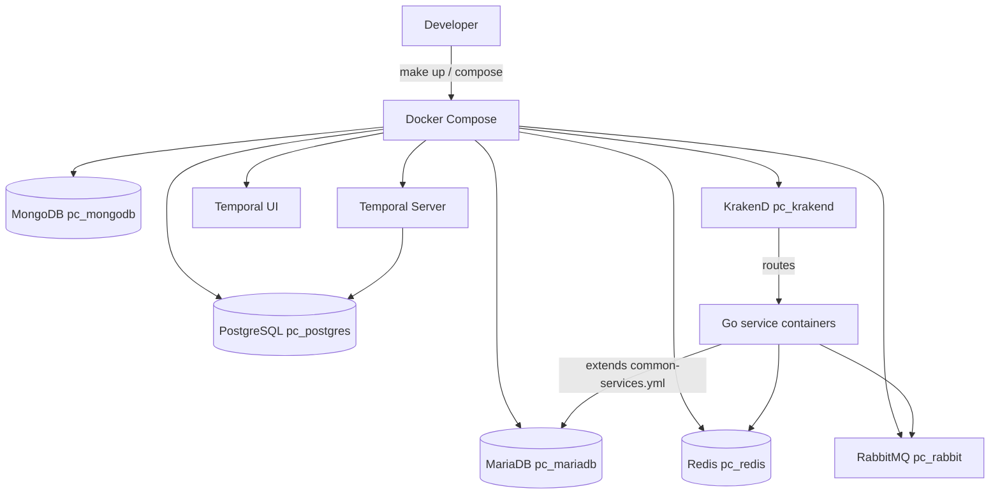
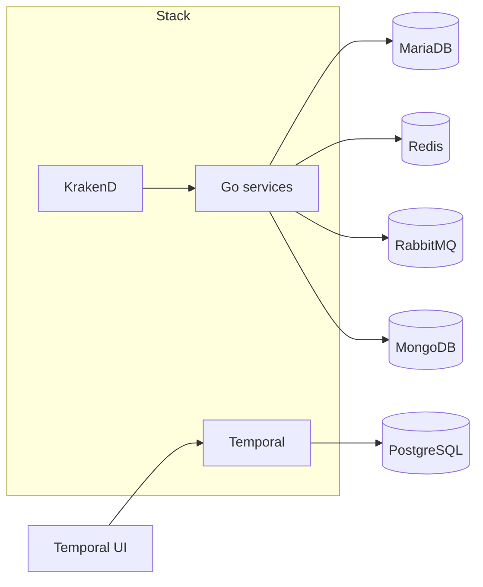

# dc_golang

> Docker Compose orchestration for local PayCloud-style development: databases, messaging, caching, API gateway wiring, and reusable Go service images.

## Overview

This repository is a **development stack definition**, not a single Go microservice. It defines containers for MariaDB, PostgreSQL, MongoDB, Redis, RabbitMQ, Temporal, KrakenD, and (optionally) Go services that extend `common-services.yml`. Host bind mounts and absolute paths in compose variants are intentionally machine-specific; pick the `docker-compose*.yml` file that matches your workstation.

Callers are typically developers running services on their laptop or CI that validates compose files. The stack talks to external repositories mounted into KrakenD and into Go service containers under `/go/src/<module>`.

## Architecture

### Service flow



### Integration map



## Stack services

Services are defined in `docker-compose.yml` and machine-specific variants (for example `docker-compose.pycd.yml`). Named containers below are stable so scripts such as `scripts/import-db.sh` keep working. If `docker compose … config` fails on a variant, ensure every `extends` target in that file still exists in `common-services.yml` (templates drift when Go versions change).

| Service       | Container        | Ports (host) | Role |
|---------------|------------------|--------------|------|
| mariadb       | `pc_mariadb`     | 3306         | Primary relational DB for many Go services |
| postgres      | `pc_postgres`    | 5432         | PostgreSQL (Temporal DB, other use cases) |
| mongodb       | `pc_mongodb`     | 27017        | Document store |
| redis         | `pc_redis`       | 6379         | Cache / ephemeral state |
| rabbit        | `pc_rabbit`      | 5672, 15672  | AMQP + management UI |
| temporal      | `pc_temporal`    | 7233, 6933–6939, 9090 | Workflow engine |
| temporal-ui   | `pc_temporal_ui` | 8081         | Temporal Web UI |
| krakend       | `pc_krakend`     | 80, 8080     | API gateway (host network in default file; mounts external gateway repo) |

Go microservices are usually added by uncommenting or copying blocks that `extends` `common-services.yml` and setting `GO_SVC` plus a bind mount to your local clone.

## Makefile quick reference

Run `make help` for the full list. Common targets:

| Target        | Description |
|---------------|-------------|
| `make network-dev` | Create the external Docker network `dev` if it does not exist |
| `make config` | Validate the active compose file |
| `make up` | Start all services in `COMPOSE_FILE` (default `docker-compose.yml`) |
| `make start` / `make up-infra` | Start MariaDB, Postgres, MongoDB, Redis, RabbitMQ |
| `make up-stack` | Start infra plus Temporal and Temporal UI |
| `make startdb` | Start only MariaDB and PostgreSQL |
| `make stop` | Stop the core infra set |
| `make down` | `docker compose down` for the file |
| `make ps` | Service status |
| `make logs S=mariadb` | Follow logs for one service (omit `S` for all) |
| `make debug-up` | Foreground `up` with `COMPOSE_DEBUG=1` and plain progress |
| `make compose ARGS="..."` | Passthrough to compose (e.g. `ARGS="exec mariadb bash"`) |
| `make shell-mariadb` | Open `mariadb` client as root inside the container |
| `make import-db FILE=x.sql` | Run `scripts/import-db.sh` |
| `make build-go-image` | Build `dc_golang:1.22` from the repo `Dockerfile` |

Override the compose file without editing the Makefile:

```bash
make up COMPOSE_FILE=docker-compose.pycd.yml
make config COMPOSE_FILE=docker-compose.pycd.yml
```

Use the legacy Compose V1 binary if needed:

```bash
make ps DOCKER_COMPOSE=docker-compose
```

## Data & automation scripts

| Script | Purpose |
|--------|---------|
| `scripts/import-db.sh` | Safer MariaDB import from `backup/db/` with preflight checks |
| `scripts/quick-import.sh` | Faster import with fewer guard rails |
| `scripts/list-db-files.sh` | Lists available `.sql` files under `backup/db/` |
| `scripts/verify-temporal-setup.sh` | Local checks for Temporal-related layout (paths inside the script may need adjusting per machine) |

## Integrations

### MariaDB

- **Purpose**: Primary SQL store for many backend modules.
- **Connection**: host `localhost` / container `pc_mariadb`, port `3306`; credentials from compose (development defaults).
- **Key operations**: Schema load via import scripts; data under a bind-mounted volume defined in the compose file.

### PostgreSQL

- **Purpose**: Temporal persistence and other PostgreSQL workloads.
- **Connection**: `pc_postgres:5432` on the `dev` network; see compose `environment` for users/passwords used by Temporal.

### MongoDB

- **Purpose**: Document storage for services that require it.
- **Connection**: `pc_mongodb:27017`; root user/password set in compose (development only).

### Redis

- **Purpose**: Caching and fast key/value access.
- **Connection**: `pc_redis:6379`.

### RabbitMQ

- **Purpose**: Messaging between services.
- **Connection**: AMQP `pc_rabbit:5672`; management UI on host port `15672` (default compose).

### Temporal

- **Purpose**: Durable workflows.
- **Connection**: Frontend `pc_temporal:7233`; UI proxied on host port `8081` for `temporal-ui`.

### KrakenD

- **Purpose**: Edge gateway and routing to upstream Go services.
- **Connection**: Binds host ports per compose; configuration is mounted from an external gateway repository path—update the volume in your machine-specific compose variant.

### Go services (`common-services.yml` + `docker/golang/run.sh`)

- **Purpose**: Run a module from `/go/src/${GO_SVC}` with `go mod download` and a Linux build via `run.sh`.
- **Configuration**: Set `GO_SVC`, `working_dir`, and volume mount to the same module path; keep them aligned per `AGENTS.md`.

## Configuration

### Prerequisites

- Docker with Compose v2 (`docker compose`) or standalone `docker-compose`.
- External network named **`dev`** (`make network-dev` creates it).
- For KrakenD and some volumes, **host paths** in the chosen compose file must exist on your machine.

### Environment files

| File | Role |
|------|------|
| `etc/environment.yml` | Env file referenced by MariaDB and related images |
| `etc/mariadb/*.cnf` | MariaDB tuning |
| `etc/rabbitmq/enabled_plugins` | RabbitMQ plugins |
| `etc/temporal/dynamic.yaml` | Temporal dynamic config |
| `etc/postgresql/init` | Postgres init scripts |

### Important variables (compose / Makefile)

| Variable | Description |
|----------|-------------|
| `COMPOSE_FILE` | Which compose file `make` uses (default `docker-compose.yml`) |
| `DOCKER_COMPOSE` | Executable, default `docker compose` |
| `GO_SVC` | Go module directory name under `/go/src` inside the container |
| `ENV` | Passed to `run.sh` for build/run mode |

Do not copy development credentials from this repo into production.

## Getting started

```bash
# Create the external network (once per Docker host)
make network-dev

# Validate configuration
make config

# Core databases + Redis + RabbitMQ
make start

# Or bring up everything defined in the compose file (includes KrakenD, Temporal, etc.)
make up

# Optional: list SQL dumps and import
make list-db
make import-db FILE=your-dump.sql
```

Build the Go dev image when you change `Dockerfile` or base tooling:

```bash
make build-go-image
```

## Project structure

```
.
├── docker-compose.yml          # Default stack (adjust volumes for your host)
├── docker-compose.*.yml        # Machine- or team-specific variants
├── common-services.yml         # Shared Go service template (go1.22)
├── Dockerfile                  # dc_golang dev image
├── Makefile                    # Compose helpers, scripts, shells
├── docker/
│   └── golang/run.sh           # Entrypoint: go mod download, build, run
├── etc/                        # MariaDB, RabbitMQ, Temporal, Postgres, env
├── scripts/                    # DB import, listing, Temporal checks
├── backup/db/                  # SQL dumps for local import
├── hooks/                      # Image build/push helpers
└── AGENTS.md                   # Agent and contributor conventions
```

## Base image note

The historical base for the Go tooling image is [jetbrainsinfra/golang](https://github.com/jetbrains-infra/docker-image-golang). The current `Dockerfile` in this repo defines the `dc_golang:1.22` image used by `common-services.yml`.

## Further reading

- [`AGENTS.md`](./AGENTS.md) — compose conventions, security notes, and dependency map.
- [`.agents/skills/docker-compose-workflows/`](./.agents/skills/docker-compose-workflows/) — validation and editing practices for this repo.
