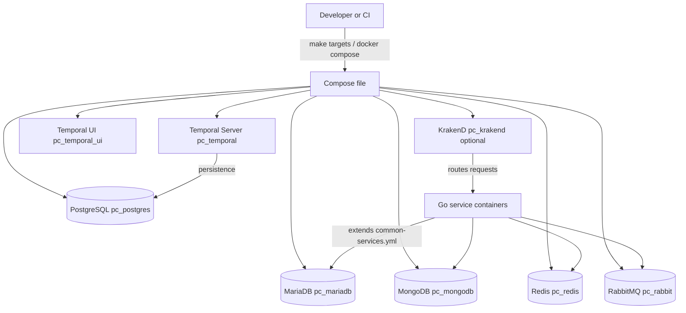
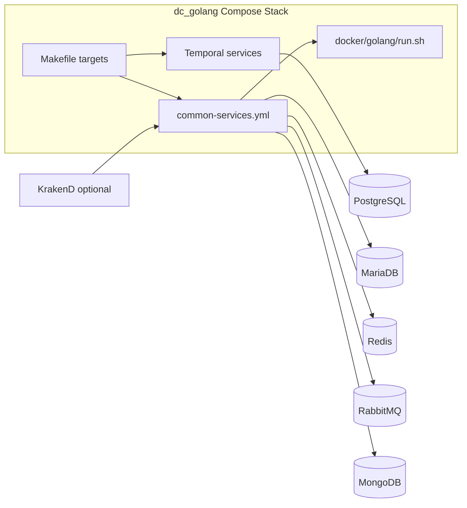
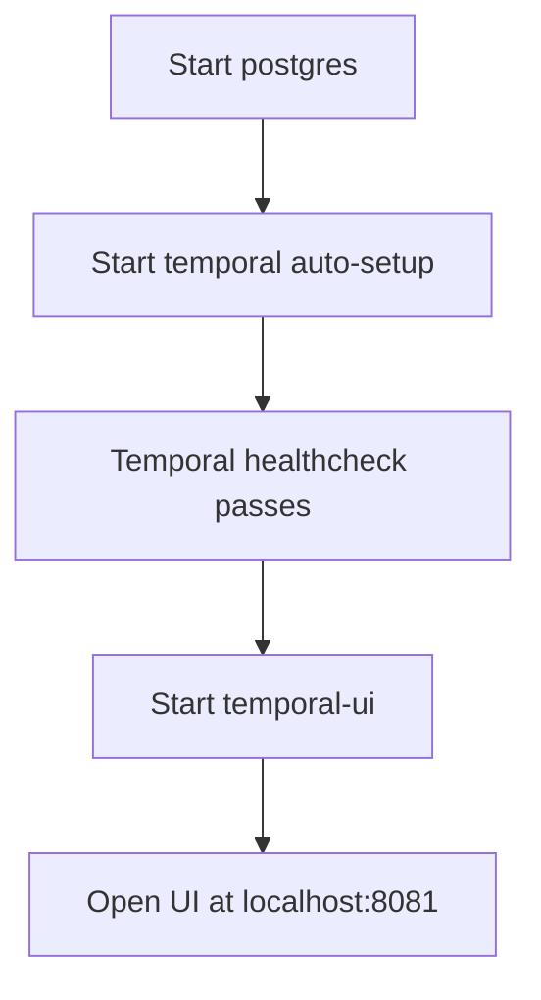
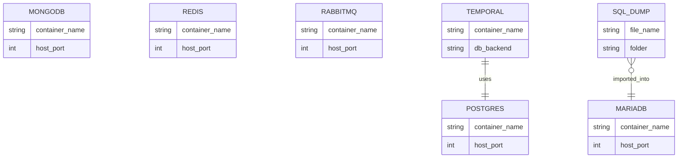

# dc_golang

> Docker Compose orchestration for local PayCloud-style development: databases, messaging, caching, workflow runtime, API gateway wiring, and reusable Go service images.

---

**Version:** 2.0.0
**Go Version:** 1.25 (toolchain in Dockerfile; repository is infrastructure-first and has no go.mod)
**Last Updated:** May 27, 2026

## Overview

This repository is a development stack definition, not a single application service. It orchestrates MariaDB, PostgreSQL, MongoDB, Redis, RabbitMQ, Temporal, Temporal UI, and optional KrakenD plus optional Go service containers that extend `common-services.yml`.

Typical users are developers running dependent services on laptops or CI jobs validating compose topology. The stack integrates with external service repositories through bind mounts into Go containers at `/go/src/<module>` and, when enabled, KrakenD mounted configuration from a separate gateway repository.

## Architecture

### Service Flow


```mermaid
flowchart TD
  Dev[Developer or CI] -->|make targets / docker compose| Compose[Compose file]
  Compose --> MariaDB[(MariaDB pc_mariadb)]
  Compose --> Postgres[(PostgreSQL pc_postgres)]
  Compose --> Mongo[(MongoDB pc_mongodb)]
  Compose --> Redis[(Redis pc_redis)]
  Compose --> Rabbit[(RabbitMQ pc_rabbit)]
  Compose --> Temporal[Temporal Server pc_temporal]
  Compose --> TemporalUI[Temporal UI pc_temporal_ui]
  Compose --> KrakenD[KrakenD pc_krakend optional]
  Temporal -->|persistence| Postgres
  GoSvc[Go service containers] -->|extends common-services.yml| MariaDB
  GoSvc --> Redis
  GoSvc --> Rabbit
  GoSvc --> Mongo
  KrakenD -->|routes requests| GoSvc
```

### Integration Map


```mermaid
flowchart LR
  subgraph ThisRepo[dc_golang Compose Stack]
    MF[Makefile targets]
    CS[common-services.yml]
    RS[docker/golang/run.sh]
    TS[Temporal services]
  end

  MF --> CS
  CS --> RS
  MF --> TS
  TS --> PG[(PostgreSQL)]
  CS --> MDB[(MariaDB)]
  CS --> R[(Redis)]
  CS --> RB[(RabbitMQ)]
  CS --> MG[(MongoDB)]
  KRA[KrakenD optional] --> CS
```

### Temporal Startup Sequence


```mermaid
flowchart TD
  A[Start postgres] --> B[Start temporal auto-setup]
  B --> C[Temporal healthcheck passes]
  C --> D[Start temporal-ui]
  D --> E[Open UI at localhost:8081]
```

## API / Interface

### Compose and Makefile Interface

| Method | Path / Command | Description |
|--------|----------------|-------------|
| CLI | `make network-dev` | Creates external Docker network `dev` when missing |
| CLI | `make config` | Validates active compose file (`COMPOSE_FILE`) |
| CLI | `make start` | Starts infra services (MariaDB, PostgreSQL, MongoDB, Redis, RabbitMQ) |
| CLI | `make up-stack` | Starts infra plus Temporal and Temporal UI |
| CLI | `make up` | Starts all services defined in selected compose file |
| CLI | `make logs S=<service>` | Streams logs for one service or all services |
| CLI | `make import-db FILE=<dump.sql>` | Imports SQL dump via safe script wrapper |
| CLI | `make verify-temporal` | Runs Temporal setup verification script |

### Script Interfaces

| Method | Path / Script | Description |
|--------|----------------|-------------|
| Shell | `scripts/import-db.sh` | Guarded MariaDB import (preflight checks and container checks) |
| Shell | `scripts/quick-import.sh` | Faster import path with fewer safety checks |
| Shell | `scripts/list-db-files.sh` | Lists SQL files available under `backup/db/` |
| Shell | `scripts/verify-temporal-setup.sh` | Validates Temporal file paths and expected compose wiring |

### Temporal Client Connection Shapes

Go example:

```go
import "github.com/temporalio/sdk-go/client"

c, err := client.Dial(client.Options{HostPort: "localhost:7233"})
if err != nil {
    panic(err)
}
defer c.Close()
```

Node.js example:

```javascript
const { WorkflowClient } = require('@temporalio/client');

const client = new WorkflowClient({
  connection: {
    address: '127.0.0.1:7233',
  },
});
```

## Data Model

The repository manages local infrastructure state rather than domain entities. Persistent data sits in service-specific volumes and imported SQL files under `backup/db/`.


```mermaid
erDiagram
  MARIADB {
    string container_name
    int host_port
  }
  POSTGRES {
    string container_name
    int host_port
  }
  MONGODB {
    string container_name
    int host_port
  }
  REDIS {
    string container_name
    int host_port
  }
  RABBITMQ {
    string container_name
    int host_port
  }
  TEMPORAL {
    string container_name
    string db_backend
  }
  SQL_DUMP {
    string file_name
    string folder
  }

  TEMPORAL ||--|| POSTGRES : uses
  SQL_DUMP }o--|| MARIADB : imported_into
```

## Integrations

### MariaDB
- **Purpose**: Primary SQL store for many local Go services.
- **Connection**: `pc_mariadb:3306` on the `dev` network and `localhost:3306` from host.
- **Key operations**: Imports via `scripts/import-db.sh`, ad-hoc queries via `make shell-mariadb`.

### PostgreSQL
- **Purpose**: Temporal persistence and other PostgreSQL-backed local modules.
- **Connection**: `pc_postgres:5432` in compose network.
- **Key operations**: Temporal auto-setup database bootstrap; interactive `psql` via `make shell-postgres`.

### MongoDB
- **Purpose**: Document storage for services requiring flexible schema.
- **Connection**: `pc_mongodb:27017`.
- **Key operations**: Local service integration testing and manual inspection via `make shell-mongo`.

### Redis
- **Purpose**: Cache and ephemeral state.
- **Connection**: `pc_redis:6379`.
- **Key operations**: Local cache/session validation and queue support from dependent services.

### RabbitMQ
- **Purpose**: AMQP messaging plus management UI.
- **Connection**: `pc_rabbit:5672`, management UI at `localhost:15672`.
- **Key operations**: Service-to-service queue testing and operator checks from web UI.

### Temporal and Temporal UI
- **Purpose**: Durable workflows, activity execution, and workflow visibility.
- **Connection**: `pc_temporal:7233` (gRPC), metrics on `9090`, UI at `localhost:8081`.
- **Key operations**: Workflow orchestration against PostgreSQL, namespace-based retention, UI inspection.

### KrakenD (Optional)
- **Purpose**: API gateway and routing layer for mounted Go services.
- **Connection**: Host ports `80` and `8080` when enabled.
- **Key operations**: Local edge routing using bind-mounted gateway configuration from an external repository path.

### Go Service Runtime Template
- **Purpose**: Reusable container execution template for Go module repositories.
- **Connection**: `common-services.yml` + `docker/golang/run.sh` with module mounted at `/go/src/${GO_SVC}`.
- **Key operations**: `go mod download`, Linux build/run cycle, and shell-based development flow.

## Configuration

### Prerequisites

- Docker Engine with Compose V2 (`docker compose`) or legacy `docker-compose` binary.
- External Docker network `dev` (`make network-dev`).
- Existing host paths for machine-specific bind mounts in `docker-compose.*.yml` variants.

### Environment Files and Config Sources

| File | Required | Default | Description |
|------|----------|---------|-------------|
| `etc/environment.yml` | Yes | N/A | Shared development env used by MariaDB-related services |
| `etc/mariadb/*.cnf` | Yes | N/A | MariaDB tuning and overrides |
| `etc/rabbitmq/enabled_plugins` | Yes | N/A | RabbitMQ plugin list |
| `etc/temporal/dynamic.yaml` | Yes (Temporal enabled) | N/A | Temporal dynamic config and namespace retention settings |
| `etc/temporal/temporal.env` | Yes (Temporal enabled) | N/A | Temporal DB and runtime environment variables |
| `etc/postgresql/init/*.sql` | Optional | N/A | PostgreSQL initialization scripts |

### Runtime Variables

| Variable | Required | Default | Description |
|----------|----------|---------|-------------|
| `COMPOSE_FILE` | No | `docker-compose.yml` | Compose file used by Make targets |
| `DOCKER_COMPOSE` | No | `docker compose` | Compose executable (`docker-compose` for V1) |
| `GO_SVC` | Yes (Go service blocks) | N/A | Service module directory under `/go/src` |
| `ENV` | No | `dev` | Runtime mode consumed by `docker/golang/run.sh` |
| `DB_ENGINE` (Temporal env) | Yes (Temporal enabled) | `postgresql` | Temporal storage backend selector |
| `POSTGRES_SEEDS` (Temporal env) | Yes (Temporal enabled) | `pc_postgres:5432` | Temporal PostgreSQL address |

### Temporal Configuration Details

- Namespaces in config: `default` (24h retention) and `dev` (30 days retention).
- Server/UI env file includes metrics enablement, JSON logging, search-attribute flags, and timezone (`Asia/Jakarta`).
- Compose exposes additional Temporal ports `6933`, `6934`, `6935`, `6936`, and `6939` for service components and frontend HTTP.

## Temporal Integration Notes

The repository includes a setup summary documenting integration outcomes and operational checks. Key points merged into this README:

| Component | Current Compose Version | Notes |
|-----------|-------------------------|-------|
| Temporal server | `temporalio/auto-setup:1.29.4` | Container `pc_temporal`, PostgreSQL backend |
| Temporal UI | `temporalio/ui:2.47.2` | Container `pc_temporal_ui`, host `:8081` |
| Temporal memory limit | `1g` | Configured in compose |
| Temporal UI memory limit | `512m` in setup summary | Current compose should be treated as source of truth |
| PostgreSQL memory limit | `400m` | Shared service for Temporal persistence |

If you run the machine-specific stack, persistent Temporal data can be mapped to a host path such as `/Users/natan/lxc/temporal` as shown in setup notes.

## Getting Started

```bash
# 1) Prepare network
make network-dev

# 2) Validate compose topology
make config

# 3) Start infra only
make start

# 4) Start infra + Temporal + UI
make up-stack

# 5) Check status and logs
make ps
make logs S=temporal
make logs S=temporal-ui

# 6) Optional DB workflow
make list-db
make import-db FILE=your-dump.sql
```

Alternative direct command (legacy style from setup notes):

```bash
docker-compose -f docker-compose.pycd.yml up -d postgres temporal temporal-ui
```

Override compose file for machine-specific layout:

```bash
make up COMPOSE_FILE=docker-compose.pycd.yml
make config COMPOSE_FILE=docker-compose.pycd.yml
```

Build the local Go dev image when changing base tooling:

```bash
make build-go-image
```

Use legacy Compose V1 binary when needed:

```bash
make ps DOCKER_COMPOSE=docker-compose
```

## Project Structure

```text
.
├── docker-compose.yml              # Default stack
├── docker-compose.*.yml            # Machine- or team-specific variants
├── common-services.yml             # Shared Go service template
├── Dockerfile                      # Go development image
├── Dockerfile.example              # Additional Docker reference image file
├── Makefile                        # Compose and script helpers
├── docker/
│   ├── golang/run.sh               # Entrypoint: download/build/run
│   ├── krakend/                    # KrakenD Dockerfile variants
│   └── mariadb/                    # MariaDB Dockerfile variants and config
├── etc/
│   ├── environment.yml             # Shared environment file
│   ├── mariadb/                    # MariaDB config helpers
│   ├── postgresql/init/            # PostgreSQL initialization SQL
│   ├── rabbitmq/                   # RabbitMQ config
│   └── temporal/                   # Temporal dynamic/env docs and scripts
├── scripts/                        # Import and verification scripts
├── backup/db/                      # SQL dumps for local import
├── hooks/                          # Image build/push helpers
├── QUICK_REFERENCE.md              # Temporal + Docker quick reference
├── TEMPORAL_SETUP_SUMMARY.md       # Temporal integration change summary
└── AGENTS.md                       # Agent and contributor conventions
```

## Operational and Security Notes

- Keep container names stable (`pc_mariadb`, `pc_postgres`, `pc_temporal`, and others); scripts and docs rely on them.
- Do not copy development credentials from compose/env files into production systems.
- Prefer `scripts/import-db.sh` over quick import for safer preflight checks.
- If compose config fails in a variant, verify `extends` targets still exist in `common-services.yml`.

## Further Reading

- [`AGENTS.md`](./AGENTS.md) for conventions and dependency map.
- [`.agents/skills/docker-compose-workflows/`](./.agents/skills/docker-compose-workflows/) for compose editing and validation workflows.
- [`etc/temporal/README.md`](./etc/temporal/README.md) for Temporal-specific setup and troubleshooting commands.
- [`QUICK_REFERENCE.md`](./QUICK_REFERENCE.md) for short-form operational commands.

## Suggestions for Future Improvement

### Content Gaps
- README can include a dedicated compatibility matrix comparing default and machine-specific compose variants.
- KrakenD enablement steps could include a concrete, end-to-end sample with expected mounted path structure.

### Structural Improvements
- Temporal operations and troubleshooting can be split into a dedicated runbook under `docs/` to keep this README shorter.
- Script interface section can link to command examples per script to reduce first-use friction.

### Clarity and Accuracy
- Temporal setup summary references server version `1.30.1` while compose files currently pin `1.29.4`; keeping one canonical version note would avoid drift.
- `Dockerfile.example` is currently aligned with `Dockerfile`; if a true multi-stage reference is needed, document that status explicitly.

### Maintenance
- Update this README whenever service versions or compose memory limits change.
- Add a periodic checklist item to run `make config` on all compose variants and refresh documented outputs.
